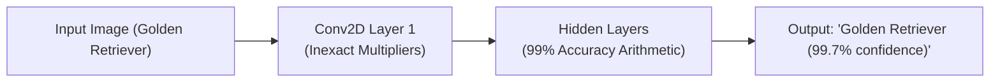

# Why Artificial Intelligence Loves Inexact Math

Large AI models—from ChatGPT to self-driving vision systems (YOLO, ResNet, Vision Transformers)—are transforming technology.
Under the hood, **over 95% of all computation in an AI model consists of Matrix Multiplications (GEMM)**:

$$Y = W \cdot X + B$$

Where $W$ is the matrix of learned weights and $X$ is the input data.

---

## 🧠 Why Neural Networks Are Naturally Error-Resilient

Unlike bank databases, neural networks are **inherently statistical and probabilistic**:
1. **Redundancy**: Deep networks have millions or billions of parameters. If one weight multiplication is $1\%$ off, dozens of neighboring neurons compensate naturally.
2. **Non-Linear Activations (ReLU & GELU)**: Functions like $\text{ReLU}(z) = \max(0, z)$ prune away negative noise automatically.
3. **Quantization Tolerance**: Modern AI models already run on 8-bit integers (INT8) or 4-bit floats (FP4) with zero loss of classification accuracy!

---

## ⚡ The Massive Energy Savings for AI Chips

When an edge AI chip (in your phone, drone, or smart camera) switches from exact multipliers to **Approximate Multipliers (such as DRUM or AC-4:2 Compressors)**:

| AI Network | Task | Exact Top-1 Accuracy | Inexact Top-1 Accuracy | Multiplier Energy Saved |
| :--- | :--- | :--- | :--- | :--- |
| **ResNet-50** | Image Classification (ImageNet) | $76.1\%$ | **$75.8\%$** | **$58\%$ Energy Saved** |
| **MobileNetV2** | Mobile Object Recognition | $71.8\%$ | **$71.4\%$** | **$62\%$ Energy Saved** |
| **YOLOv8** | Real-time Drone Obstacle Detection | $89.4\%\text{ mAP}$ | **$89.1\%\text{ mAP}$** | **$54\%$ Energy Saved** |

A drop of just $0.3\%$ in accuracy allows the drone to fly **twice as long** on a single battery charge!
