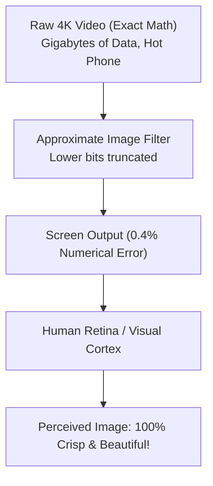

# Why Human Eyes and Ears Forgive Inexact Math

Have you ever wondered why JPEG pictures take up only $1/10$th of the file size of raw uncompressed photos, yet they look virtually identical?

The secret lies in human biology and **perceptual noise masking**.

---

## 👁️ Biology 101: The Human Visual System

Human eyes are not perfect digital video cameras. Our retina and visual cortex have built-in limitations:
1. **Luminance vs. Chrominance**: We are very sensitive to brightness differences, but much less sensitive to slight color shifts in high-frequency patterns.
2. **Spatial Contrast Sensitivity**: Our eyes cannot resolve micro-pixel variations when adjacent pixels change rapidly.
3. **Temporal Integration**: At 60 frames per second, tiny 1-frame pixel errors blur smoothly into motion.

---

## 🖼️ The 2D Convolution Mystery

When your phone applies a blur filter, an edge detector, or a portrait mode effect, it performs a mathematical operation called **2D Convolution**:

$$\text{Pixel}_{\text{new}}(x, y) = \sum_{i=-1}^{1} \sum_{j=-1}^{1} \text{Image}(x+i, y+j) \times \text{Kernel}(i, j)$$

For a 12-Megapixel photo, this means doing **over 100 million multiplications and additions**!

- In an **Exact Processor**: Every one of those 100 million multiplications calculates the carry propagation down to bit zero.
- In an **Inexact Processor (e.g. TOSAM or DRUM)**: Lower bits are truncated, using $60\%$ less energy. The resulting image has a **$\text{PSNR} > 38\text{ dB}$**, meaning the differences are completely invisible to the human eye!

---

## 🎧 The Same Thing Happens in Audio

When you listen to Spotify or Apple Music, the audio stream has already discarded high-frequency sound waves that human ears cannot hear (the psychoacoustic model).

Using approximate adders and multipliers in audio filters (such as equalizer bass/treble DSPs) saves battery without degrading acoustic fidelity.
