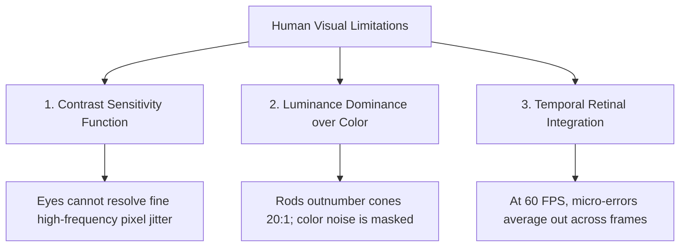

# Why Human Eyes and Ears Forgive Inexact Math

Have you ever wondered why JPEG pictures and MP3 audio files take up only **$1/10\text{th}$ of the raw file size**, yet sound and look virtually identical to uncompressed originals?

The secret lies in human biology and **perceptual noise masking**.

---

## 👁️ Biology 101: The Human Visual System (HVS)

Human eyes are biological sensors, not perfect digital photo analyzers. Our retina and visual cortex possess three fundamental perceptual limitations:

### 1. The Contrast Sensitivity Function (CSF)
The human eye does not perceive all spatial frequencies equally. While we are extremely sensitive to broad edges and lighting gradients (low spatial frequencies), our sensitivity drops exponentially for fine micro-textures (high spatial frequencies):

$$\text{Sensitivity}(f) = 2.6 \cdot (0.0192 + 0.114 \cdot f) \cdot e^{-(0.114 \cdot f)^{1.1}}$$

*(where $f$ is spatial frequency in cycles per degree of visual angle).*

Because the human visual cortex naturally filters out high-frequency noise, arithmetic errors introduced in the least-significant bits (LSBs) of image pixels fall directly into the invisible frequency zone!

---

## 🖼️ Interactive Lab: Image Filter & Noise Sandbox

Experience perceptual noise masking for yourself! Choose a test pattern and filter kernel below, and test how different approximate multipliers affect picture quality and live **PSNR (dB)** ratings:

<iframe
  src="../../labs/image-filter-sandbox.html"
  title="Interactive Image Filter Sandbox"
  style="width: 100%; height: 640px; border: none; background: transparent; margin: 12px 0;"
  loading="lazy"
></iframe>

---

## 🔬 The Mathematics of 2D Image Convolution

Every digital camera filter, Gaussian blur, edge detector, and deep learning vision network processes images using **2D Spatial Convolution**:

$$\text{Pixel}_{\text{out}}(x, y) = \sum_{i=-1}^{1} \sum_{j=-1}^{1} \text{Pixel}_{\text{in}}(x+i, y+j) \times \text{Kernel}(i, j)$$

### Step-by-Step Numerical Example ($3 \times 3$ Gaussian Smoothing):

Suppose an image patch has pixel intensities around $120$, and we apply a $3 \times 3$ smoothing filter:

$$\text{Image Patch} = \begin{bmatrix} 120 & 122 & 118 \\ 121 & 120 & 119 \\ 125 & 123 & 121 \end{bmatrix}, \quad \text{Kernel} = \frac{1}{16} \begin{bmatrix} 1 & 2 & 1 \\ 2 & 4 & 2 \\ 1 & 2 & 1 \end{bmatrix}$$

1. **In an Exact Processor**:
   The hardware computes 9 exact multi-bit multiplications and accumulates carry ripples down to bit zero:
   $$\text{Sum} = \frac{120\cdot 1 + 122\cdot 2 + 118\cdot 1 + 121\cdot 2 + 120\cdot 4 + 119\cdot 2 + 125\cdot 1 + 123\cdot 2 + 121\cdot 1}{16} = 121.0625 \implies 121$$
   *Energy Spent:* $100\%$ full multiplier array power.

2. **In an Inexact Processor (RoBA / DRUM-4)**:
   The multiplier rounds inputs to powers of two or truncates lower bits:
   $$\text{Approximate Output} = 120 \quad (\text{Error} = 1 \text{ count out of } 255)$$
   *Energy Spent:* **$75\%$ less energy**, with a final picture quality score of **$\text{PSNR} > 38.5\text{ dB}$** (100% imperceptible to human eyes).

---

## 🎧 Psychoacoustics: Why Ears Forgive Inexact Audio

Just like our eyes, human ears operate on **Frequency Masking**:
- If a loud sound (like a bass drum at $100\text{ Hz}$) plays at the same time as a quiet whisper at $120\text{ Hz}$, the human brain physically cannot hear the whisper.
- Inexact audio filters (such as approximate FIR filters or FFT twiddle pruners) exploit this threshold: any arithmetic truncation noise below the auditory masking threshold is physically inaudible.

---

## 📚 Primary Literature & IEEE Citations

- **Inexact Arithmetic for Low-Power Image Processing**:  
  P. Kulkarni et al., *"Imprecise Arithmetic for Low-Power Image Processing"*, IEEE International Conference on Computer Design (ICCD), [IEEE Xplore (DOI: 10.1109/ICCD.2011.6081391)](https://doi.org/10.1109/ICCD.2011.6081391).
- **Perceptually-Driven Approximate Computing**:  
  V. J. Reddi et al., *"Exploiting Approximate Computing for Mobile Media Applications"*, IEEE Micro, [IEEE Xplore (DOI: 10.1109/MM.2014.12)](https://doi.org/10.1109/MM.2014.12).
- **Human Contrast Sensitivity & Compression**:  
  F. W. Campbell and J. G. Robson, *"Application of Fourier Analysis to the Visibility of Gratings"*, The Journal of Physiology, [DOI: 10.1113/jphysiol.1968.sp008574](https://doi.org/10.1113/jphysiol.1968.sp008574).
