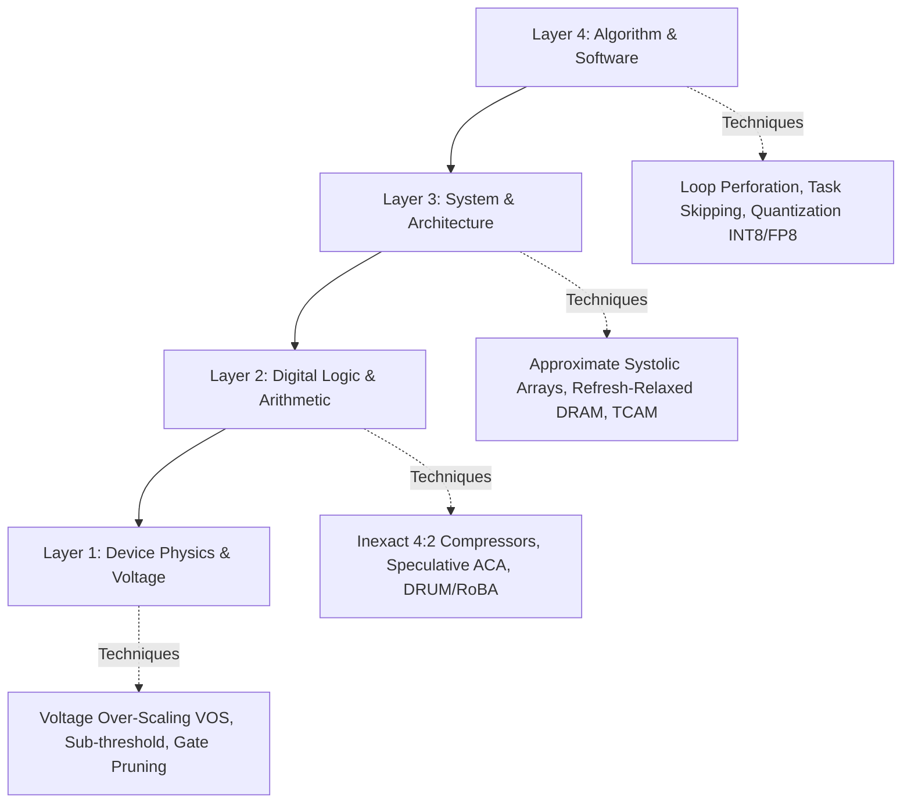

# Approximation Paradigms Across the Stack

Approximate computing is not confined to a single circuit trick. True energy efficiency is unlocked when approximation principles are applied **cooperatively across all four layers of the computing stack**: from device physics to high-level software algorithms.

---

## 🏗️ The 4-Layer Approximation Stack



---

## ⚡ Layer 1: Device Physics & Voltage Scaling

### 1. Voltage Over-Scaling (VOS)
The dynamic switching power of a CMOS digital circuit is governed by:

$$P_{\text{dynamic}} = \alpha \cdot C_L \cdot V_{DD}^2 \cdot f_{\text{clk}}$$

Because power scales **quadratically ($V_{DD}^2$)**, reducing supply voltage from $1.0\text{V}$ to $0.7\text{V}$ cuts energy consumption by over **$51\%$**!
- **The Catch**: Lowering $V_{DD}$ increases transistor gate delay ($\tau \propto \frac{V_{DD}}{(V_{DD}-V_{th})^\alpha}$).
- **The Approximate Lever**: In an exact circuit, running at low voltage causes timing violations (setup time failures) that crash the CPU. In approximate computing, paths are structurally designed so that only the least-significant bits (LSBs) suffer timing violations, while MSB paths are protected with extra timing slack!

### 2. Gate-Level Logic Pruning
Automated synthesis algorithms (e.g. *SALSA*, *ABACUS*) analyze a gate netlist and selectively delete ("prune") logic gates that contribute minimally to output accuracy while consuming significant static leakage power.

---

## 🎛️ Layer 2: Logic & Arithmetic Microarchitecture

This is the primary focus of silicon hardware designers:

1. **Speculative Addition (ACA / GeAr)**: Slicing long 32-bit carry chains into small overlapping 4-bit lookahead windows, converting $\mathcal{O}(N)$ delay into $\mathcal{O}(k)$ delay.
2. **Inexact Partial Product Compressors (AC-4:2 / 5:2)**: Modifying full adder truth tables to eliminate multi-layer XOR gates inside Wallace reduction trees, slashing transistor counts by $45\%$.
3. **Leading-One Detection & Windowing (DRUM)**: Dynamically selecting a narrow $k$-bit slice of active bits from wide operands, replacing a $16 \times 16$ multiplier with a tiny $4 \times 4$ core.
4. **Logarithmic Arithmetic (Mitchell / LEAD)**: Using the identity $\log_2(A \cdot B) = \log_2(A) + \log_2(B)$ to transform multi-cycle multiplications into single-cycle additions.

---

## 🖥️ Layer 3: System & Memory Architecture

1. **Refresh-Relaxed DRAM**: Extending DRAM capacitor refresh intervals from $64\text{ms}$ to $256\text{ms}$ for non-critical video framebuffers, cutting standby refresh power by $65\%$.
2. **Voltage-Scaled On-Chip SRAM**: Dropping cache voltage below the critical Static Noise Margin (SNM) for deep learning activation tensors.
3. **Approximate Spintronic / Non-Volatile Memory (STT-MRAM / PCM)**: Reducing write current pulse widths to save energy at the cost of tiny read bit-error rates.

---

## 🧠 Layer 4: Algorithm & Software Level

1. **Loop Perforation**: Compilers automatically transform long iterative loops:
   ```c
   // Exact Loop: 1000 iterations
   for (int i = 0; i < 1000; i++) { compute_frame(i); }
   
   // Perforated Loop: 500 iterations (2x faster, 50% energy)
   for (int i = 0; i < 1000; i += 2) { compute_frame(i); interpolate(i+1); }
   ```
2. **Task & Computation Skipping**: In video encoding (HEVC/H.265), skipping motion estimation search for macroblocks whose motion vector variance is nearly zero.
3. **Model Quantization**: Converting 32-bit floating point (FP32) deep learning weights down to 8-bit integers (INT8) or 4-bit integers (INT4), reducing memory bandwidth by $4\times$ to $8\times$.

---

## 📚 Primary Literature & IEEE Citations

- **Cross-Layer Approximate Computing Framework**:  
  M. Shafique et al., *"Cross-Layer Approximate Computing: From Logic to Architectures"*, ACM/IEEE DAC, [ACM/IEEE (DOI: 10.1145/2897937.2905011)](https://doi.org/10.1145/2897937.2905011).
- **ABACUS: Automated Behavioral Approximation**:  
  K. Nepal et al., *"ABACUS: A Technique for Automated Behavioral Synthesis of Approximate Computing Circuits"*, IEEE/ACM DATE, [IEEE/ACM (DOI: 10.7873/date.2014.075)](https://doi.org/10.7873/date.2014.075).
- **Loop Perforation & Algorithmic Resilience**:  
  S. Sidiroglou-Douskos et al., *"Managing Performance vs. Accuracy Trade-Offs with Loop Perforation"*, ACM FSE, [ACM (DOI: 10.1145/2025113.2025133)](https://doi.org/10.1145/2025113.2025133).
- **Voltage Over-Scaling for Signal Processing**:  
  R. Hegde and N. R. Shanbhag, *"Soft Digital Signal Processing"*, IEEE Transactions on Very Large Scale Integration (VLSI) Systems, [IEEE Xplore (DOI: 10.1109/92.920828)](https://doi.org/10.1109/92.920828).
