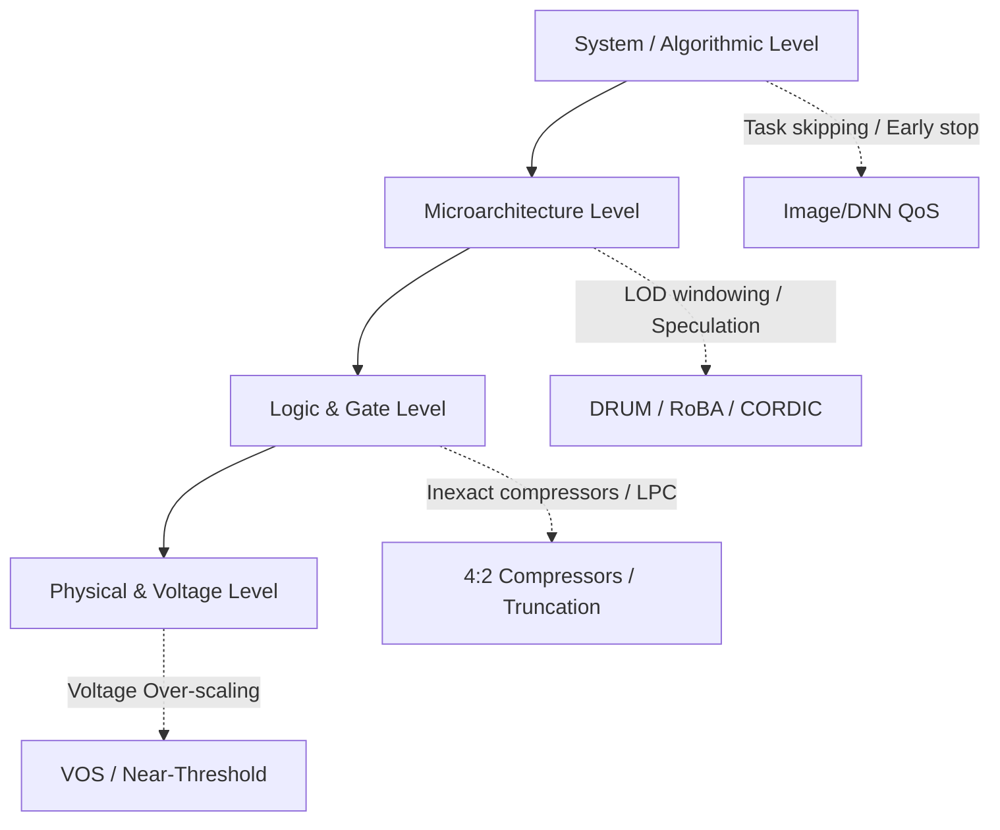

# Approximation Paradigms Across the Stack

Approximate computing techniques span from the circuit level up to the system architecture.

---

## 1. Logic & Microarchitecture Techniques

### A. Static & Dynamic Truncation
- **Static Truncation (Fixed-width)**: Omission of $k$ lower-order partial product columns.
- **Dynamic Truncation (DRUM / Segmented)**: Dynamically detecting the most-significant active window of bits using Leading-One Detectors (LOD).

### B. Inexact Logic & Compressor Simplification
- Replacing full adders and 4:2 / 5:2 compressors with truth-table modifications that eliminate complex XOR trees and reduce critical path delay.

### C. Speculative Arithmetic & Carry Truncation
- Breaking long carry-propagation paths by calculating sums based on a short look-ahead window, accepting occasional carry mispredictions.

### D. Logarithmic & Power-of-Two Approximations
- Converting linear multiplication into additions in the logarithm domain (e.g. Mitchell's algorithm, RoBA), replacing multiplier arrays with shifters and simple adders.

---

## 2. Dynamic Voltage & Quality Adaptation

- **Voltage Over-Scaling (VOS)**: Operating circuits below nominal supply voltage to save quadratic power ($P \propto V^2$), where timing violations are confined to lower-significance logic paths.
- **Runtime QoS Adaptation**: Dynamically scaling arithmetic truncation levels based on battery state, frame rate targets, or temperature envelopes.
