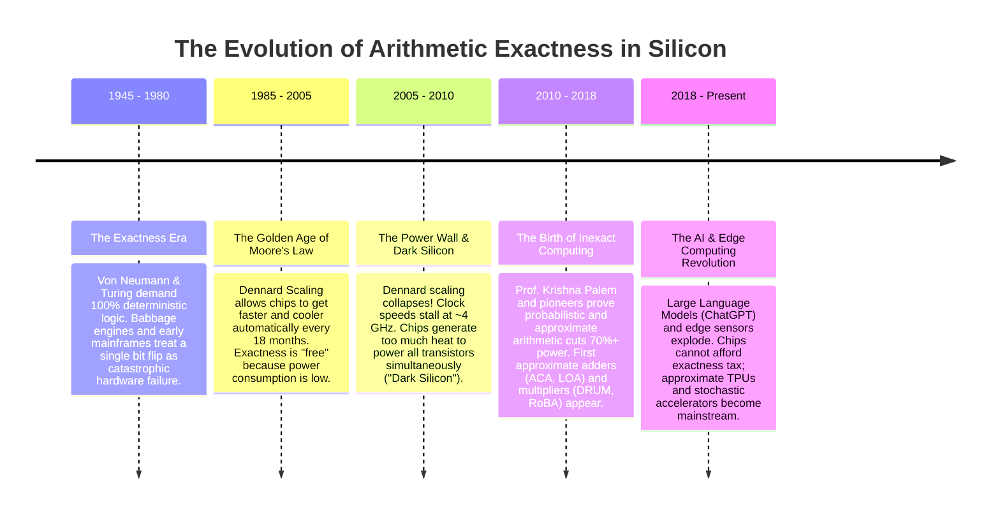

# History & Evolution of Inexact Computing

How did the computing world transition from the rigid demand for **100% mathematical perfection** to intentionally designing **circuits that make calculated mistakes**?

---

## ⏳ Timeline: The Century-Long Journey



---

## 🏛️ Phase 1: The Quest for Absolute Perfection (1940s – 1990s)

In the dawn of computer science, early computers were built for **ballistics calculation, nuclear physics simulations, and accounting**. In those domains, precision was non-negotiable:
- If a bank balance is off by $\$0.01$, people lose trust.
- If an orbital trajectory calculation drops a carry bit, a spacecraft misses its target.

Because early vacuum tubes and relays were prone to random hardware faults, computer pioneers (John von Neumann, Claude Shannon, Richard Hamming) spent decades creating **Error-Correcting Codes (ECC)**, triple-modular redundancy, and strict synchronous timing to ensure that **1 + 1 always equaled 2, zero exceptions**.

---

## 💥 Phase 2: The Collapse of Dennard Scaling (2005)

For thirty years, **Dennard Scaling** was the magic engine of the tech industry: as transistors shrank, their power density stayed constant. You could pack $2\times$ more transistors, run them faster, and the chip wouldn't melt.

Around **2005**, Dennard scaling hit the laws of quantum physics:
1. **Voltage Scaling Stalled**: Transistors became so small that electrical current began leaking through the microscopic gate oxides even when turned off.
2. **The Thermal Wall**: If chip designers kept increasing clock frequencies, processor dies would reach temperatures hotter than a rocket nozzle!
3. **The "Dark Silicon" Dilemma**: In modern sub-7nm chips, **over 50% of the silicon must remain powered off ("dark")** at any given moment to prevent the processor from burning itself out.

```
+-------------------------------------------------------------------+
|                     THE POST-2005 SILICON CRISIS                  |
|                                                                   |
|   Transistors keep shrinking ──> But cannot be powered all at once|
|   Result: We cannot make exact circuits faster by brute force!     |
+-------------------------------------------------------------------+
```

---

## 💡 Phase 3: The Paradigm Shift (Palem & Inexact Computing)

In the late 2000s, researchers like **Prof. Krishna Palem** (Rice University / NTU) and leading VLSI architects asked a revolutionary question:

> *"Why are we spending 70% of our precious battery power to guarantee 100% precision for applications that don't need it?"*

They observed that the fastest-growing computing workloads—**digital photos, video streaming, music synthesis, and machine learning**—had something in common:
- The human eye cannot tell if a background pixel is `128` or `129`.
- The human ear cannot distinguish microscopic phase jitter in a sound wave.
- A neural network doesn't care if an image weight is $0.4501$ instead of $0.4500$.

By intentionally relaxing the requirement for 100% precision, engineers discovered they could **prune carry chains, eliminate Wallace-tree compressors, and drop operating voltages**, achieving up to **$3\times$ to $5\times$ energy efficiency improvements**.

---

## 📚 Primary Literature & Historical Citations

For students and historians studying the founding papers of inexact and approximate computing:

- **Probabilistic & Energy-Aware Computing**:  
  K. V. Palem, *"Energy Aware Computing Through Probabilistic Arithmetic"*, IEEE/ACM CASES, [ACM/IEEE (DOI: 10.1145/951710.951713)](https://doi.org/10.1145/951710.951713).
- **The Emerging Paradigm of Approximate Computing**:  
  J. Han and M. Orshansky, *"Approximate Computing: An Emerging Paradigm for Energy-Efficient Design"*, IEEE European Test Symposium (ETS), [IEEE Xplore (DOI: 10.1109/ets.2013.6569370)](https://doi.org/10.1109/ets.2013.6569370).
- **Retrospective and Prospective View of Approximate Computing**:  
  Q. Xu et al., *"A Retrospective and Prospective View of Approximate Computing"*, Proceedings of the IEEE, [IEEE Xplore (DOI: 10.1109/jproc.2020.2975695)](https://doi.org/10.1109/jproc.2020.2975695).
- **EnerJ: Safe Approximate Data Types**:  
  A. Sampson et al., *"EnerJ: Approximate Data Types for Safe and General-Purpose Low-Power Systems"*, ACM PLDI, [ACM (DOI: 10.1145/1993498.1993518)](https://doi.org/10.1145/1993498.1993518).
