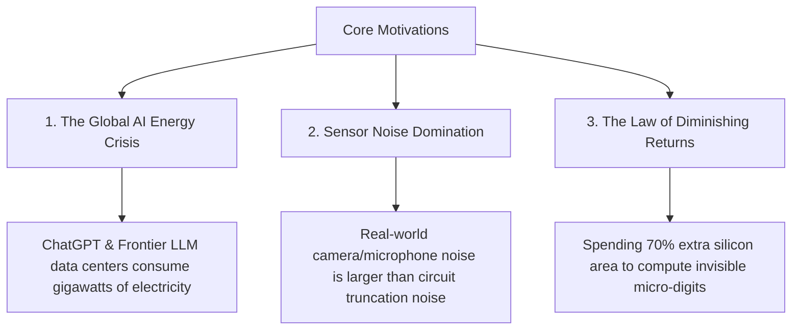
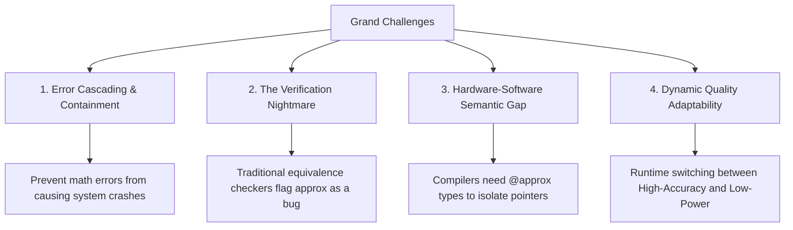

# Motivations, Problems & Grand Challenges

Why is the semiconductor industry betting billions of dollars on approximate computing, and what are the open engineering hurdles that researchers are solving today?

---

## 🚀 The Three Core Motivations

### 1. The Global AI Energy Crisis
Training and deploying modern Artificial Intelligence (GPT-4, Claude, Gemini, Autonomous Driving Vision) requires massive server clusters containing hundreds of thousands of GPUs.
- A single large data center can consume as much electricity as a city of **100,000 homes**.
- Over **80% of that energy is spent on matrix multiplications** ($C = A \times B$).
- If neural accelerators switch to approximate compressors or logarithmic arithmetic, data centers can **reduce cooling and power demand by 40% to 60%** with negligible impact on AI answer quality.

### 2. Physical Sensor Noise Floor
When your smartphone takes a photo or records audio:
- Photons striking the camera sensor experience **thermal shot noise** and **lens distortion**.
- Microphones capture **ambient room reverberations** and air pressure fluctuations.

Because the incoming analog data already contains **$1\%$ to $3\%$ physical noise**, spending millions of logic gates to process that noisy data with $0.0000001\%$ mathematical precision is completely pointless!

---

## 🧗 The Four Grand Challenges

Designing approximate hardware is not as simple as randomly dropping transistors. Engineers face four major scientific challenges:

### Challenge 1: Error Cascading (The "Butterfly Effect")
If a circuit makes a tiny $0.5\%$ error in Step 1, and that value is passed into a feedback loop (like a recursive IIR filter or an ODE physics solver), the error can compound exponentially until the entire output becomes `NaN` or garbage.
- **Solution**: Designing **Error-Bounded Circuits** with guaranteed mathematical limits on **Maximum Error Distance (MED)** and **Worst-Case Error Bounds**.

### Challenge 2: The Verification Nightmare
For 50 years, electronic design automation (EDA) tools (e.g. Synopsys Formality, Cadence Conformal) verified chips using **Combinational Equivalence Checking (CEC)**: comparing the gate-level netlist against the golden specification.
- If an approximate circuit produces `11` instead of `12`, the automated EDA checker throws an alarm: *"FATAL BUG DETECTED!"*
- **Solution**: Researchers are creating new **Probabilistic and Approximate Equivalence Checkers** (e.g., *i-CECApprox*, *PEMACX*) that verify *error distributions* rather than bit-for-bit identity.

### Challenge 3: The Hardware-Software Semantic Gap
Programming languages like C, C++, and Rust assume deterministic data types (`int`, `float`, `double`).
- If an approximate arithmetic unit accidentally operates on a **memory address pointer** or a **loop counter variable** (`for (int i=0; i<100; i++)`), the program will suffer a **Segmentation Fault** and crash the operating system!
- **Solution**: Type-safe languages (like *EnerJ* and *Axilog*) allow developers to annotate variables with `@approx` or `approximate`, guaranteeing hardware isolation between non-critical data and critical pointers.

### Challenge 4: Runtime Quality Adaptability (DVAS)
An autonomous vehicle driving in clear sunny weather can run its vision chips in ultra-low-power approximate mode. But when heavy rain or fog appears, the system must dynamically switch back to high-precision mode.
- **Solution**: **Accuracy-Configurable Adders & Multipliers** (e.g., *GeAr*, *ACAM*, *DVAS*) that let the operating system adjust precision levels on-the-fly via software control registers.

---

## 📚 Primary Literature & IEEE Citations

For researchers and engineers exploring verification frameworks, language safety, and error containment:

- **Error-Resilient Hardware Design with Approximate Computing**:  
  M. Shafique et al., *"Cross-Layer Approximate Computing: From Logic to Architectures"*, IEEE/ACM DAC, [ACM/IEEE (DOI: 10.1145/2897937.2905011)](https://doi.org/10.1145/2897937.2905011).
- **Automated Verification of Approximate Circuits (i-CECApprox)**:  
  S. Rai et al., *"i-CECApprox: Enabling Automated Combinational Equivalence Checking for Approximate Circuits"*, IEEE/ACM DATE, [IEEE/ACM (DOI: 10.23919/date.2018.8342232)](https://doi.org/10.23919/date.2018.8342232).
- **Dynamic Voltage and Accuracy Scaling (DVAS)**:  
  V. Camus et al., *"DVAS: Dynamic Voltage-Accuracy Scaling for Increased Energy Efficiency in Approximate Computing"*, IEEE Transactions on Circuits and Systems I: Regular Papers, [IEEE Xplore (DOI: 10.1109/TCSI.2017.2764063)](https://doi.org/10.1109/TCSI.2017.2764063).
- **Axilog: Language Support for Approximate Hardware Design**:  
  A. Yazdanbakhsh et al., *"Axilog: Language Support for Approximate Hardware Design"*, IEEE/ACM DATE, [IEEE/ACM (DOI: 10.7873/date.2014.108)](https://doi.org/10.7873/date.2014.108).
