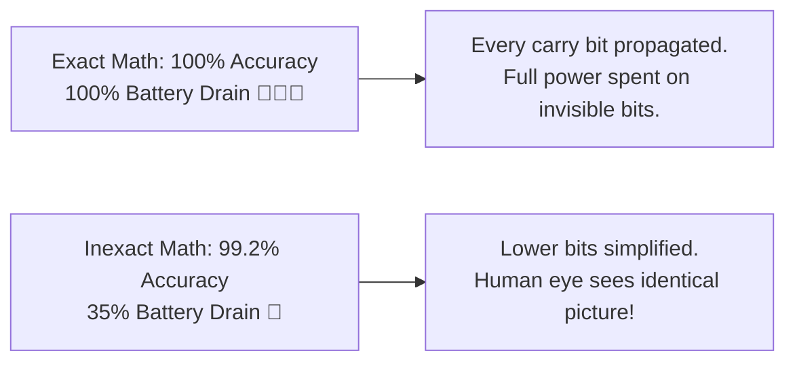

# Why Inexact Computing? (The 1% Rule & Battery Life)

Imagine you are watching a 4K movie on your phone. Every second, your phone calculates millions of math operations to color every single pixel on your screen.

Now ask yourself: **If one tiny pixel in the corner of the background has a color code of `214` instead of `215`, would your eye ever notice?**

The answer is **never**. Human eyes, ears, and brain networks simply cannot detect tiny fractions of a percent difference in sensory data.



---

## 🛑 The "Exactness Tax" of Modern Computers

For the last 60 years, computer chips were designed with a strict rule: **Zero Error Allowed**.
Every single addition, subtraction, and multiplication had to produce the 100% mathematically exact result down to the very last binary bit.

While this makes sense for **bank account balances** or **rocket trajectories**, it turns out to be tremendously wasteful for:
- 🎮 **Video games & 3D graphics** (Lighting, shadows, physics simulations)
- 📸 **Phone cameras & image filters** (Instagram filters, portrait mode, JPEG compression)
- 🤖 **Artificial Intelligence & ChatGPT** (Neural network matrix multiplications)
- 🎧 **Music & Voice recognition** (Siri, noise cancellation, MP3 audio)

In these fields, computing exact numbers costs up to **$3\times$ more energy and heat**, while delivering an output that is completely indistinguishable to human perception!

---

## ⚡ How Approximate Computing Fixes This

Approximate computing (also called *Inexact Computing*) treats mathematical accuracy as a **flexible budget** rather than a fixed rule:

$$\text{Trade } 1\% \text{ Accuracy} \implies \text{Gain } 50\%–70\% \text{ Energy & Speed Savings}$$

```
+-------------------------------------------------------------+
|               TRADITIONAL EXACT MULTIPLIER                  |
|  [ 16-bit Multiply ] ---> 256 partial products + Full tree  |
|  Power: 100% | Delay: 1.0 ns | Error: 0.00%                 |
+-------------------------------------------------------------+
                              VS
+-------------------------------------------------------------+
|               INEXACT / APPROXIMATE MULTIPLIER              |
|  [ 16-bit Multiply ] ---> Lower 6 bits truncated/hacked     |
|  Power: 38%  | Delay: 0.6 ns | Error: 0.8% (Invisible!)     |
+-------------------------------------------------------------+
```

---

## 🧩 Test Your Understanding

Take this quick 4-question interactive check to test your intuition:

<iframe
  src="../labs/quiz-inexact-mastery.html"
  title="Inexact Mastery Quiz"
  style="width:100%; height:620px; border:1px solid rgba(255,255,255,0.1); border-radius:8px; background:#0f172a; margin: 16px 0;"
  loading="lazy"
></iframe>
