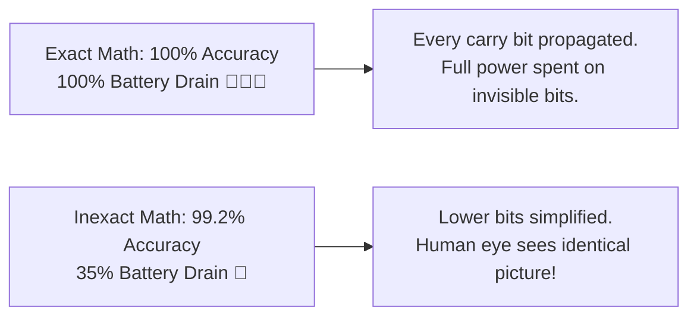

# Why Inexact Computing? (The 1% Rule & The Energy Wall)

Imagine you are streaming a 4K movie on your smartphone. Every single second, your phone executes billions of mathematical operations to compute the exact RGB color code of every pixel displayed on the OLED screen.

Now ask yourself: **If one tiny pixel in the background has an RGB brightness code of `214` instead of `215`, would your eye ever notice?**

The answer is **never**. Human eyes, ears, and biological neural pathways operate within physical perceptual thresholds. They cannot detect minute fractional differences in sensory information.



---

## 🛑 The "Exactness Tax" of Modern Silicon

For more than six decades, digital computer chips have been designed under a single non-negotiable axiom: **Zero Numerical Error Allowed**. Every single addition, subtraction, multiplication, and memory transaction had to compute the mathematically exact result down to the least significant bit.

While this absolute precision is indispensable for **banking transactions, cryptography, and orbital mechanics**, it is extraordinarily wasteful for modern error-resilient workloads:

```
+-------------------------------------------------------------------------+
|                  THE "EXACTNESS TAX" IN REAL WORKLOADS                  |
+-------------------------------------------------------------------------+
| 🤖 Artificial Intelligence & LLMs : Tolerates statistical weight noise  |
| 📸 Computer Vision & Filters       : Bound by Human Visual System (HVS) |
| 🎧 Audio & Speech Recognition      : Masked by acoustic auditory limits |
| 🎮 Real-Time 3D Rendering         : Temporal frame averaging masks noise|
| 📡 Edge IoT Sensor Streams         : Ambient physical noise floor > LSBs|
+-------------------------------------------------------------------------+
```

In all these applications, calculating exact numbers costs up to **$3\times$ more energy, heat, and silicon area**, while delivering an output that is completely indistinguishable to human perception!

---

## ⚡ The Fundamental Energy & Physics Law

The power consumption of digital CMOS circuits is governed by:

$$P_{\text{total}} = \alpha \cdot C_{\text{eff}} \cdot V_{DD}^2 \cdot f + I_{\text{leak}} \cdot V_{DD}$$

When we relax the requirement of $100\%$ numerical exactness:
1. **Effective Capacitance ($\alpha C_{\text{eff}}$) Drops**: Eliminating deep carry-propagation chains, complex Wallace reduction trees, and wide booth encoders slashes gate counts and dynamic toggle activity by **$50\%$ to $70\%$**.
2. **Voltage Scaling ($V_{DD}^2$)**: Shorter critical paths allow the supply voltage $V_{DD}$ to be lowered closer to the transistor threshold voltage ($V_{th}$), yielding quadratic energy savings.
3. **Silicon Area Reduction**: Pruning lower-order logic reduces silicon die footprint, allowing more cores or neural processing elements to fit onto the same chip.

$$\text{Trade } 1\% \text{ Accuracy} \implies 50\% \text{ to } 70\% \text{ Energy \& Delay Reduction}$$

```
+-------------------------------------------------------------------------+
|                      TRADITIONAL EXACT MULTIPLIER                       |
|  [ 16-bit Multiply ] ---> 256 partial products + Full reduction tree   |
|  Power: 100% | Delay: 1.0 ns | Area: 100% | Error: 0.00%                |
+-------------------------------------------------------------------------+
                                    VS
+-------------------------------------------------------------------------+
|                     APPROXIMATE COMPRESSOR MULTIPLIER                   |
|  [ 16-bit Multiply ] ---> Lower columns compressed with AC-4:2 cells   |
|  Power: 38%  | Delay: 0.58 ns | Area: 44% | Error: 0.6% (Invisible!)   |
+-------------------------------------------------------------------------+
```

---

## 🧩 Test Your Understanding

Test your intuition with this interactive quiz:

<iframe
  src="../../labs/quiz-inexact-mastery.html"
  title="Inexact Mastery Quiz"
  style="width: 100%; height: 820px; border: none; background: transparent; margin: 12px 0;"
  loading="lazy"
></iframe>
