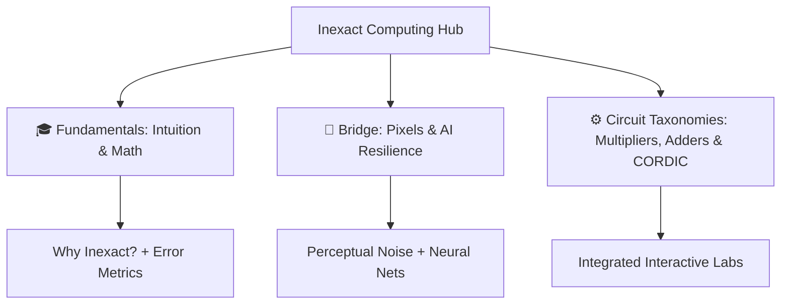

# Inexact Computing Learning & Research Portal

Welcome to the **Inexact Computing Learning and Research Portal**, an open-access living laboratory and interactive educational resource for **approximate and inexact arithmetic computing**.

---

## 🎯 Objectives & Scope

Approximate computing trades tiny, bounded amounts of mathematical accuracy for massive reductions in power consumption, silicon area, and critical path delay in error-resilient applications:
- **Artificial Intelligence & Deep Learning** (Conv2D, GEMM, Transformer attention)
- **Computer Vision & Image Processing** (Filtering, Edge detection, JPEG/HEVC compression)
- **Signal Processing & Audio** (FFT, FIR filters, CORDIC coordinate rotations)

---

## 📚 Interactive Navigation Guide

| Section | Description |
| :--- | :--- |
| [**Glossary**](glossary.md) | Plain-English definitions of core inexact computing concepts and acronyms. |
| [**Fundamentals**](fundamentals/why-approximate-computing.md) | The 1% Rule, Error Metrics Made Easy (pizza/dollar analogies), and mathematical error bounds. |
| [**Bridge to Real World**](bridge/human-eyes-and-pixels.md) | Why human eyes forgive pixel noise (includes live **Image Filter Sandbox**) and why AI models thrive on inexact arithmetic. |
| [**Circuit Taxonomies**](taxonomy/multipliers.md) | Complete architectural guides with live embedded interactive labs for **Multipliers**, **Adders**, and **CORDIC**. |

---

## 🔬 Repository & Source Code

- **GitHub Repository**: [Inexact-Computing/public](https://github.com/Inexact-Computing/public)
- **Parent Laboratory**: [Inexact-Computing/inexact-computing-lab](https://github.com/Inexact-Computing/inexact-computing-lab)
- **License**: CC BY 4.0 (Creative Commons Attribution 4.0 International)
