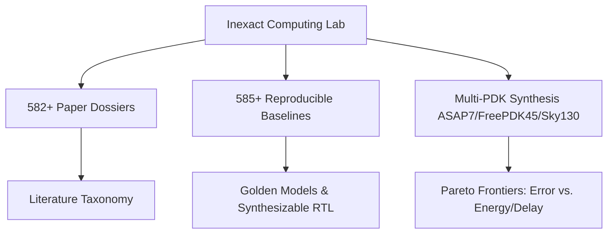

# Inexact Computing Learning & Research Portal

Welcome to the **Inexact Computing Learning and Research Portal**, an open-access living research laboratory and educational resource for **approximate and inexact arithmetic circuit design**.

---

## 🎯 Objectives & Scope

Approximate computing trades strict arithmetic accuracy for significant reductions in power consumption, silicon area, and critical path delay in error-resilient applications such as:
- **Deep Learning / Neural Network Accelerators** (Conv2D, GEMM, Transformer attention)
- **Computer Vision & Image Processing** (Filtering, Edge detection, JPEG/HEVC compression)
- **Signal Processing & Wireless Communications** (FFT, FIR, CORDIC coordinate rotations)

This portal synthesizes knowledge extracted from **582+ peer-reviewed papers**, **585+ reproducible baseline work packages**, and standardized multi-PDK synthesis results.

---

## 📚 Navigation Guide

| Section | Description |
| :--- | :--- |
| [**Glossary**](glossary.md) | Plain-English definitions of core inexact computing concepts and acronyms. |
| [**Fundamentals**](fundamentals/error-metrics.md) | Mathematical definitions of error metrics ($\text{MED}, \text{MRED}, \text{NMED}, \text{WCE}, \text{ER}$) and approximation paradigms. |
| [**Architectures**](taxonomy/multipliers.md) | Microarchitectural taxonomies of approximate multipliers, adders, dividers, and CORDIC units. |
| [**Catalog & Benchmarks**](benchmarks/catalog.md) | Searchable literature database and empirical Pareto frontiers across standard cell PDKs. |

---

## 🔬 Repository & Artifacts

- **GitHub Repository**: [SJTU-YONGFU-RESEARCH-GRP/inexact-computing-lab](https://github.com/SJTU-YONGFU-RESEARCH-GRP/inexact-computing-lab)
- **License**: CC BY 4.0 (Creative Commons Attribution 4.0 International)
