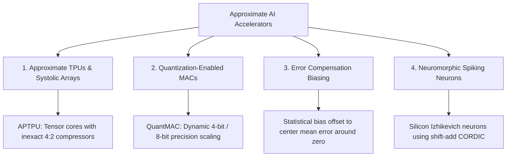

# Approximate AI Accelerators & Systolic Arrays

Modern Artificial Intelligence (Large Language Models, Vision Transformers, and Autonomous Driving CNNs) is built on one core mathematical primitive: **Matrix Multiplication ($C = A \times B$)**.

Running a single query through a deep neural network requires billions of **Multiply-Accumulate (MAC)** operations. Approximate hardware accelerators tailor silicon datapaths specifically for neural tolerance.

---

## 🧩 The Systolic Array: How AI Chips Multiply Fast

In a Tensor Processing Unit (TPU) or GPU Tensor Core, data flows like blood through a rhythmic grid of Processing Elements (PEs) called a **Systolic Array**:

```
 Inputs (A) ---> [ PE 0,0 ] ---> [ PE 0,1 ] ---> [ PE 0,2 ]
                 |               |               |
                 v               v               v
 Inputs (B) ---> [ PE 1,0 ] ---> [ PE 1,1 ] ---> [ PE 1,2 ]
                 |               |               |
                 v               v               v
                 [ PE 2,0 ] ---> [ PE 2,1 ] ---> [ PE 2,2 ]
                                 (Matrix Result C Accumulates Downward)
```

Inside every individual PE box is a multiplier and an accumulator ($Acc = Acc + A \times B$).

By replacing the exact MAC units inside the systolic array with **approximate compressor-based MACs** or **logarithmic multipliers**, an AI accelerator can:
1. Double the number of PEs packed onto the silicon die.
2. Cut thermal heat generation by up to $50\%$.
3. Maintain over $98.5\%$ top-1 classification accuracy on ImageNet / ResNet models.

---

## 🏛️ Major Families of Inexact Neural Accelerators



### 1. Approximate Tensor Processing Units (APTPU)
- Integrates approximate compressors into the systolic matrix engine.
- Exploits neural network weight regularization (weights are naturally distributed around zero) to achieve near-zero perceptual degradation.

### 2. Output Error Compensation & Mean Centering
- Simple truncation always underestimates answers (negative error bias). Inexact AI accelerators inject a small positive static constant offset ($+\mu_{\text{error}}$) into the accumulator register, shifting the average error to **exactly 0.0%**.

### 3. Neuromorphic Biomimetic Neurons
- Spiking Neural Networks (SNNs) emulate biological brains by sending voltage spikes. Approximate CORDIC and non-linear differential equation solvers allow millions of silicon neurons (Izhikevich / FitzHugh-Nagumo models) to run on ultra-low edge power budgets.

---

## 📚 Primary Literature & IEEE Citations

For researchers and students exploring accelerator microarchitectures, PyTorch emulation frameworks, and silicon results:

- **Approximate Tensor Processing Units (APTPU)**:  
  S. Yang et al., *"APTPU: Approximate Computing-Based Tensor Processing Unit for Deep Learning"*, IEEE Transactions on Circuits and Systems I: Regular Papers, [IEEE Xplore (DOI: 10.1109/tcsi.2022.3206262)](https://doi.org/10.1109/tcsi.2022.3206262).
- **Inexact Computation-Based Systolic Arrays**:  
  M. S. Hosseini et al., *"Design and Evaluation of Inexact Computation-Based Systolic Array for Convolutional Neural Networks"*, IEEE LASCAS, [IEEE Xplore (DOI: 10.1109/lascas56464.2023.10108234)](https://doi.org/10.1109/lascas56464.2023.10108234).
- **Systolic Array Architecture with Approximate 4:2 Compressors**:  
  V. S. Rao et al., *"Hardware Implementation of Systolic Array Architecture Using 4:2 Compressor Approximate Multiplier"*, IEEE ICRAMET, [IEEE Xplore (DOI: 10.1109/ICRAMET62801.2024.10809351)](https://doi.org/10.1109/ICRAMET62801.2024.10809351).
- **Profile-Based Output Error Compensation**:  
  Y. Li et al., *"Profile-Based Output Error Compensation for Approximate Arithmetic Circuits"*, IEEE Transactions on Circuits and Systems I: Regular Papers, [IEEE Xplore (DOI: 10.1109/tcsi.2020.2996567)](https://doi.org/10.1109/tcsi.2020.2996567).
- **Low-Power Neuromorphic Neurons with Approximate CORDIC**:  
  K. S. et al., *"Low-Power Hyperbolic CORDIC Design of the FitzHugh-Nagumo Neuron for Neuromorphic Applications"*, IEEE TVLSI, [IEEE Xplore (DOI: 10.1109/TVLSI.2021.3092254)](https://doi.org/10.1109/TVLSI.2021.3092254).
