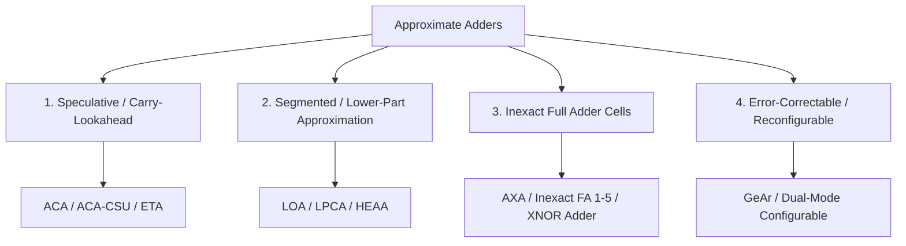

# Approximate Adders Taxonomy

Adders form the foundational atomic unit of all arithmetic pipelines. Approximate adders eliminate carry-chain propagation delay or reduce gate count.

---

## 1. Classification Taxonomy

---

## 2. Representative Comparison

| Family | Architecture | Mechanism | Critical Delay ($T_{crit}$) | Area Reduction |
| :--- | :--- | :--- | :--- | :--- |
| **Speculative** | **ACA / ACA-CSU** | Carry prediction across $k$-bit window | $\mathcal{O}(k)$ vs $\mathcal{O}(N)$ | $15\%–30\%$ |
| **Lower-Part Constant** | **LPCA / LOA** | Bitwise OR / constant in LSBs | $\mathcal{O}(N-k)$ | $35\%–55\%$ |
| **Inexact Cell** | **AXA / LAHAF** | Optimized 8–10 transistor inexact FAs | $\mathcal{O}(N)$ (Faster gate delay) | $40\%–60\%$ |
| **Parallel Prefix** | **AXPPA** | Pruned Kogge-Stone/Brent-Kung trees | $\mathcal{O}(\log k)$ | $25\%–45\%$ |
