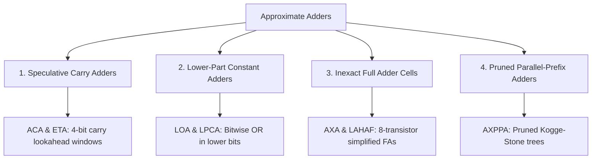

# Approximate Adders Taxonomy

Adders are the fundamental atomic building blocks of all computational hardware. Every multiplier, ALU, processor core, and CORDIC unit relies on addition.

---

## 🛑 The Carry Propagation Bottleneck

In binary arithmetic, adding two 16-bit numbers:

$$S_i = A_i \oplus B_i \oplus C_i, \quad C_{i+1} = (A_i \cdot B_i) + (C_i \cdot (A_i \oplus B_i))$$

Notice the catch: **Bit 15 cannot produce its final sum until the carry signal $C$ has rippled all the way from Bit 0 through Bit 14!**
This long chain of dependent gates forms the **Critical Path Delay** of the computer chip.

```
[Bit 0] ---> Carry ---> [Bit 1] ---> Carry ---> ... ---> [Bit 15]
 (Takes 16 Gate Delays for signal to reach the end!)
```

---

## ⚡ Interactive Lab: Carry Propagation Race

Watch the carry signal ripple across a 16-bit adder in real time, and see how approximate adders cut the chain to achieve **$3\times$ faster clock frequencies**:

<iframe
  src="../../labs/adder-carry-race.html"
  title="Adder Carry Propagation Race"
  style="width: 100%; height: 500px; border: none; background: transparent; margin: 12px 0;"
  loading="lazy"
></iframe>

---

## 🏛️ Major Families of Approximate Adders



### 1. Speculative Adders (Almost-Correct Adder — ACA)
- **The Concept**: In real-world data (audio, image, sensor feeds), carry signals rarely ripple more than 4 or 5 consecutive bits before encountering a pair of zeros that kills the carry.
- **The Design**: The adder is sliced into independent $k$-bit overlapping blocks (e.g. $k=4$). Each block predicts its carry from a short lookahead window, reducing delay from $\mathcal{O}(N)$ to $\mathcal{O}(k)$ with $<0.5\%$ error rate!

### 2. Lower-Part Approximation Adders (LOA / LPCA)
- **The Concept**: For the lower $k$ bits (least significant bits), replace the full adder hardware with simple **bitwise OR gates** ($S_i = A_i \mid B_i$) and eliminate carry generation entirely.
- **The Result**: Saves $50\%$ of silicon area in the lower half of the datapath while keeping the high-order bits 100% exact.

### 3. Inexact Full Adder Cells (AXA / LAHAF)
- **The Concept**: An exact Full Adder requires 28 transistors in standard CMOS. By modifying the truth table to allow 1 or 2 minor deviations, we can build functional full adders using **only 8 to 12 transistors**.

---

## 📚 Primary Literature & IEEE Citations

For researchers and students exploring the fundamental papers and silicon verification:

- **Almost-Correct Adder (ACA)**:  
  A. K. Verma et al., *"Variable Latency Speculative Addition: A New Paradigm for Low-Power Design"*, IEEE Transactions on Very Large Scale Integration (VLSI) Systems, [IEEE Xplore (DOI: 10.1109/TVLSI.2010.2040645)](https://doi.org/10.1109/TVLSI.2010.2040645).
- **Lower-Part-OR Adder (LOA)**:  
  H. R. Mahdiani et al., *"Bio-Inspired Imprecise Computational Blocks for Efficient VLSI Implementation of Soft-Computing Applications"*, IEEE TVLSI, [IEEE Xplore (DOI: 10.1109/TVLSI.2009.2019803)](https://doi.org/10.1109/TVLSI.2009.2019803).
- **Generic Accuracy Configurable Adder (GeAr)**:  
  M. Shafique et al., *"GeAr: A Generalized Methodology for Energy-Efficient Approximate Adders"*, IEEE Transactions on Computer-Aided Design of Integrated Circuits and Systems (TCAD), [IEEE Xplore (DOI: 10.1109/TCAD.2015.2413840)](https://doi.org/10.1109/TCAD.2015.2413840).
- **Low-Power Area-Efficient Approximate Full Adders (LAHAF / AXA)**:  
  P. Balasubramanian et al., *"Hardware Optimized Approximate Adder with Normal Error Distribution"*, IEEE TCSI, [IEEE Xplore (DOI: 10.1109/TCSI.2017.2764063)](https://doi.org/10.1109/TCSI.2017.2764063).
