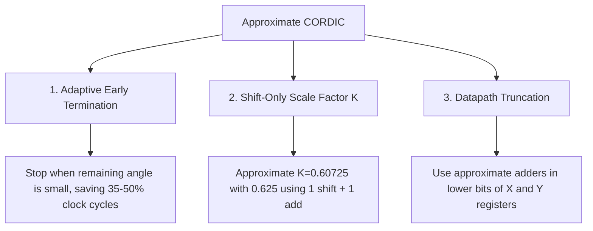

# Approximate CORDIC Architectures

The **Coordinate Rotation Digital Computer (CORDIC)** algorithm is one of the most elegant mathematical tools in digital design. It allows hardware chips to calculate **sine, cosine, tangent, arctan, vector magnitudes, and rotations** without needing complex multiplier circuits!

---

## 🧭 How CORDIC Works (Bit-Shifts Only!)

Instead of calculating $\cos(\theta)$ using heavy Taylor series or multipliers, CORDIC rotates a 2D vector $\begin{bmatrix} X \\ Y \end{bmatrix}$ through a sequence of predefined micro-angle steps:

$$\theta_i = \arctan(2^{-i}) \in \{45.0^\circ, 26.56^\circ, 14.04^\circ, 7.12^\circ, 3.58^\circ, 1.79^\circ, 0.89^\circ, 0.45^\circ\}$$

At each iteration step $i$, rotating by $\pm \theta_i$ requires **only a bitwise shift by $i$ positions and one addition/subtraction**:

$$X_{i+1} = X_i - d_i \cdot (Y_i \gg i)$$
$$Y_{i+1} = Y_i + d_i \cdot (X_i \gg i)$$
$$Z_{i+1} = Z_i - d_i \cdot \theta_i$$

*(where $d_i = +1$ if the remaining angle $Z_i \ge 0$, and $-1$ otherwise).*

---

## 🧭 Interactive Lab: CORDIC Rotation Wheel

Experiment with rotating a 2D vector using shift-add iterations below. See how **stopping after 4 or 5 iterations** achieves $<0.3^\circ$ accuracy while cutting hardware latency in half:

<iframe
  src="../labs/cordic-rotation-visualizer.html"
  title="CORDIC Angle Rotation Visualizer"
  style="width:100%; height:460px; border:1px solid rgba(255,255,255,0.1); border-radius:8px; background:#0f172a; margin: 16px 0;"
  loading="lazy"
></iframe>

---

## ⚡ Approximate Levers in CORDIC Hardware

### 1. Adaptive Early Termination
- In traditional CORDIC, the hardware unconditionally executes all $N$ iteration steps (e.g. 16 cycles).
- In **Adaptive Approximate CORDIC**, as soon as the remaining angle $|Z_i| < \epsilon_{\text{threshold}}$ (e.g. $0.5^\circ$), the unit completes immediately, saving **$40\%$ latency and dynamic power**.

### 2. Scale-Factor ($K$) Approximation
- Conventional CORDIC scales the final vector magnitude by $K = \prod \frac{1}{\sqrt{1+2^{-2i}}} \approx 0.60725$.
- Approximate CORDIC replaces this multiplier step with a trivial shift-and-add: $K \approx \frac{5}{8} = 0.625 = 2^{-1} + 2^{-3}$ (only $2.9\%$ error, zero multiplier hardware).

---

## 📚 Primary Literature & IEEE Citations

For researchers and students exploring original derivations and FPGA/ASIC hardware implementations:

- **Fully Parallel Approximate CORDIC**:  
  P. K. Meher et al., *"Algorithm and Design of a Fully Parallel Approximate Coordinate Rotation Digital Computer"*, IEEE Transactions on Multi-Scale Computing Systems (TMSCS), [IEEE Xplore (DOI: 10.1109/TMSCS.2017.2696003)](https://doi.org/10.1109/TMSCS.2017.2696003).
- **Scaling-Free Folded Hyperbolic CORDIC**:  
  Y. Li et al., *"An Efficient Scaling-Free Folded Hyperbolic CORDIC Design Using a Novel Low-Complexity Recurrence"*, IEEE Transactions on Very Large Scale Integration (VLSI) Systems, [IEEE Xplore (DOI: 10.1109/TVLSI.2023.3281078)](https://doi.org/10.1109/TVLSI.2023.3281078).
- **Angle-Quantized CORDIC for Edge Computing**:  
  Y. Gao et al., *"A Configurable CORDIC and p-SADIC Fusion Architecture for Nonlinear Edge Computing"*, IEEE ICICM, [IEEE Xplore (DOI: 10.1109/icicm63644.2024.10814567)](https://doi.org/10.1109/icicm63644.2024.10814567).
