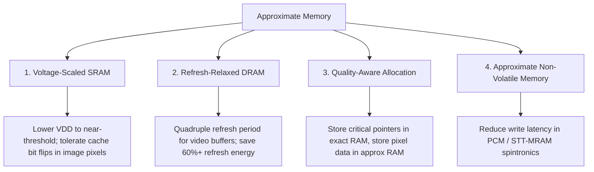

# Approximate Memory & Storage

Modern computer chips spend **more than 40% of their total power on memory** (SRAM caches on-chip and external DRAM / LPDDR RAM chips). A substantial portion of that power is spent merely *preventing bit flips* through guard-banding and constant electrical refreshing.

Approximate memory challenges the assumption that every bit in storage must remain 100% stable at all times.

---

## 🔋 The Two Giants of Memory Power

1. **SRAM Voltage Guard-Bands**: On-chip CPU/GPU cache lines use 6-transistor (6T) SRAM cells. To guarantee zero errors under extreme heat or voltage drops, chips run at elevated voltage levels (e.g. $0.9\text{V}$ instead of $0.6\text{V}$). Because power scales quadratically with voltage ($P \propto V^2$), this guard-band costs massive energy!
2. **DRAM Refresh Cycles**: Dynamic RAM stores bits as tiny electrical charges in micro-capacitors. Because charges leak over time, DRAM controllers must periodically read and recharge every row thousands of times per second.

```
[ Normal 100% Refresh ] ---> 64ms Refresh Rate ---> Zero Bit Flips ---> 100% Standby Power
[ Approximate Refresh  ] ---> 256ms Refresh Rate ---> ~0.01% Bit Flips ---> 65% Standby Power Saved!
```

---

## 🏛️ Major Families of Approximate Memory



### 1. Quality-Aware Data Allocation
- Program memory is split into two regions:
  - **Critical Region (Exact)**: Loop counters, pointer addresses, operating system code, and memory management structures are protected with 100% exact error-correcting codes (ECC).
  - **Approximate Region (Low Power)**: Image framebuffers, audio PCM samples, and deep learning intermediate feature maps are stored in low-voltage or low-refresh memory. A single flipped bit in pixel RGB(128, 64, 32) turning into RGB(128, 65, 32) is invisible to human eyes!

### 2. Approximate SRAM for Neural Networks
- Deep learning activation matrices have high error resilience. Dropping SRAM supply voltage by $30\%$ cuts dynamic and static leakage power by over $50\%$ while model classification accuracy drops by less than $0.2\%$.

---

## 📚 Primary Literature & IEEE Citations

For researchers and students exploring circuit measurements, retention tests, and memory controller architectures:

- **Approximate SRAM for CNN Inference**:  
  P. N. Whatmough et al., *"Approximate SRAM for Energy-Efficient Privacy-Preserving Convolutional Neural Networks"*, IEEE Computer Society Annual Symposium on VLSI (ISVLSI), [IEEE Xplore (DOI: 10.1109/isvlsi.2017.117)](https://doi.org/10.1109/isvlsi.2017.117).
- **Quality-Aware Data Allocation in Approximate DRAM**:  
  K. He et al., *"Quality-Aware Data Allocation in Approximate DRAM"*, IEEE/ACM CASES, [IEEE Xplore (DOI: 10.1109/cases.2015.7324549)](https://doi.org/10.1109/cases.2015.7324549).
- **Embedded Gain-Cell DRAM for Low Power**:  
  P. Meinerzhagen et al., *"An 800-MHz Mixed-Vt 4T Gain-Cell Embedded DRAM in 28-nm CMOS"*, IEEE ESSCIRC, [IEEE Xplore (DOI: 10.1109/esscirc.2017.8094587)](https://doi.org/10.1109/esscirc.2017.8094587).
- **Approximate Storage in Spintronic Memories (STT-MRAM)**:  
  A. Ranjan et al., *"Approximate Storage for Energy-Efficient Spintronic Memories"*, ACM/IEEE Design Automation Conference (DAC), [ACM/IEEE (DOI: 10.1145/2744769.2744799)](https://doi.org/10.1145/2744769.2744799).
- **Approximate Storage in Flash / Solid-State Memories**:  
  J. Sampson et al., *"Approximate Storage in Solid-State Memories"*, ACM/IEEE MICRO, [ACM/IEEE (DOI: 10.1145/2540708.2540712)](https://doi.org/10.1145/2540708.2540712).
