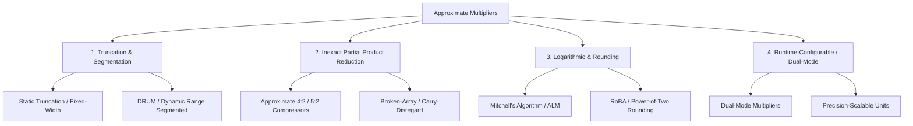

# Approximate Multipliers Taxonomy

Multipliers dominate the energy and silicon area budgets in digital signal processing (DSP) and neural network accelerators.

---

## 1. Classification Taxonomy

---

## 2. Representative Architectures & Trade-offs

| Family | Representative Design | Key Mechanism | Error Character ($\text{MRED}$) | Energy Saving |
| :--- | :--- | :--- | :--- | :--- |
| **Dynamic Range** | **DRUM** | LOD-based $k$-bit active window selection | Low ($\approx 1\%–3\%$) | $40\%–65\%$ |
| **Rounding** | **RoBA** | Rounding to $2^k$, shifter-based multiply | Moderate ($\approx 3\%–8\%$) | $50\%–75\%$ |
| **Compressor-based** | **AC-4:2 / Dadda-Ax** | Inexact truth-table 4:2 compressors | Very Low ($\approx 0.2\%–1.5\%$) | $25\%–45\%$ |
| **Broken-Array** | **BAM / SIBAM** | Omission of LSB carry generation | Low ($\approx 0.5\%–2.0\%$) | $30\%–50\%$ |
| **Logarithmic** | **REALM / Mitchell** | Log2 piecewise approximation | Moderate ($\approx 2\%–6\%$) | $60\%–80\%$ |
