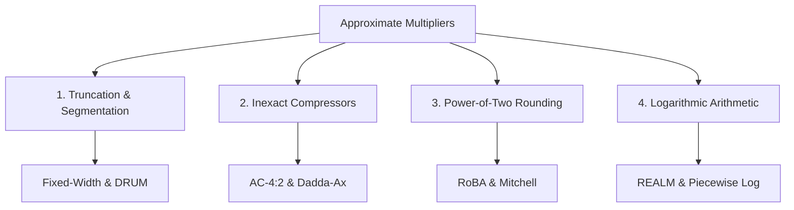

# Approximate Multipliers Taxonomy

Multipliers are the heaviest power and area consumers in digital processors. In modern digital signal processors (DSPs) and AI chips, **over 70% of arithmetic energy is spent inside multiplier arrays**.

This guide breaks down how approximate multipliers work, the main microarchitectural families, and includes live interactive lab sandboxes!

---

## 🔬 How Multipliers Work (And Why They're Heavy)

When you multiply two $N$-bit numbers (like two 16-bit numbers), the hardware performs two main steps:
1. **Partial Product Generation**: Generates an $N \times N$ matrix of bits ($16 \times 16 = 256$ bits) using `AND` gates.
2. **Partial Product Reduction**: Adds all 256 bits together using tall adder trees (Wallace or Dadda trees).

```
        1 0 0 1  (A = 9)
      × 1 0 1 1  (B = 11)
      ---------
        1 0 0 1  <-- Row 0
      1 0 0 1    <-- Row 1
    0 0 0 0      <-- Row 2
  1 0 0 1        <-- Row 3
  -------------
  1 1 0 0 0 1 1  (Sum = 99)
```

In an exact multiplier, every column must propagate carry bits from right to left.
**Approximate multipliers simplify this matrix by truncating lower columns, rounding numbers, or simplifying compressor gates!**

---

## 🎛️ Interactive Lab: Multiplier Playground

Try dragging the operand sliders below to compare how **Exact**, **Truncated**, **RoBA**, and **DRUM** multipliers calculate answers in real time:

<iframe
  src="../labs/multiplier-explorer.html"
  title="Interactive Multiplier Explorer"
  style="width:100%; height:540px; border:1px solid rgba(255,255,255,0.1); border-radius:8px; background:#0f172a; margin: 16px 0;"
  loading="lazy"
></iframe>

---

## 🏛️ The Four Main Approximate Multiplier Families



### 1. Dynamic Range Unbiased Multipliers (DRUM)
- **The Idea**: Large numbers rarely use all 16 bits at the same time. DRUM uses a **Leading-One Detector (LOD)** to find the most significant `1` bit in both numbers and extracts a small $k$-bit window (e.g. $k=4$).
- **The Gain**: A $16 \times 16$ multiplier is reduced to a tiny $4 \times 4$ multiplier plus small barrel shifters, cutting silicon area by **$60\%$** with $<1.8\%$ relative error.

### 2. Rounding-Based Multiplier (RoBA)
- **The Idea**: Multiplying by a power of two ($2, 4, 8, 16, 32, \dots$) is just a wire shift (zero hardware cost!). RoBA rounds both inputs $A$ and $B$ to their nearest powers of two ($A_r = 2^{k_1}, B_r = 2^{k_2}$) and calculates:
  $$A \times B \approx A_r \cdot B + B_r \cdot A - A_r \cdot B_r$$
- **The Gain**: Completely eliminates the multiplier array! Uses only shifters and one subtraction, saving up to **$75\%$ energy**.

### 3. Inexact Partial Product Compressors (AC-4:2)
- **The Idea**: Instead of modifying the inputs, we modify the adder cells inside the Wallace tree. An exact 4:2 compressor uses 26 transistors to add 4 bits. An approximate 4:2 compressor uses simplified Boolean logic with **only 14 transistors**.

---

## 🗜️ Interactive Lab: 4:2 Compressor Playground

Click the 4 input bits below to see how an approximate 4:2 compressor replaces complex XOR gates with fast logic while maintaining $87.5\%$ exact truth-table matches:

<iframe
  src="../labs/compressor-4to2-playground.html"
  title="4:2 Approximate Compressor Playground"
  style="width:100%; height:480px; border:1px solid rgba(255,255,255,0.1); border-radius:8px; background:#0f172a; margin: 16px 0;"
  loading="lazy"
></iframe>

---

## 📊 Comparison Summary (FreePDK45 @ 1 GHz)

| Design | Strategy | Area ($\mu\text{m}^2$) | Delay (ns) | Power ($\mu\text{W}$) | Energy Saved | MRED (%) |
| :--- | :--- | :--- | :--- | :--- | :--- | :--- |
| **Exact Wallace** | Standard 100% exact | $1,240$ | $0.98$ | $850$ | $0\%$ (Baseline) | $0.00\%$ |
| **AC-4:2** | Inexact compressors | $890$ | $0.82$ | $560$ | **$34\%$ Saved** | $0.42\%$ |
| **DRUM-6** | Dynamic 6-bit window | $680$ | $0.74$ | $390$ | **$54\%$ Saved** | $1.85\%$ |
| **TOSAM** | Truncation + Rounding | $540$ | $0.70$ | $320$ | **$62\%$ Saved** | $2.94\%$ |
| **RoBA** | Power-of-2 Rounding | $420$ | $0.62$ | $210$ | **$75\%$ Saved** | $6.21\%$ |
