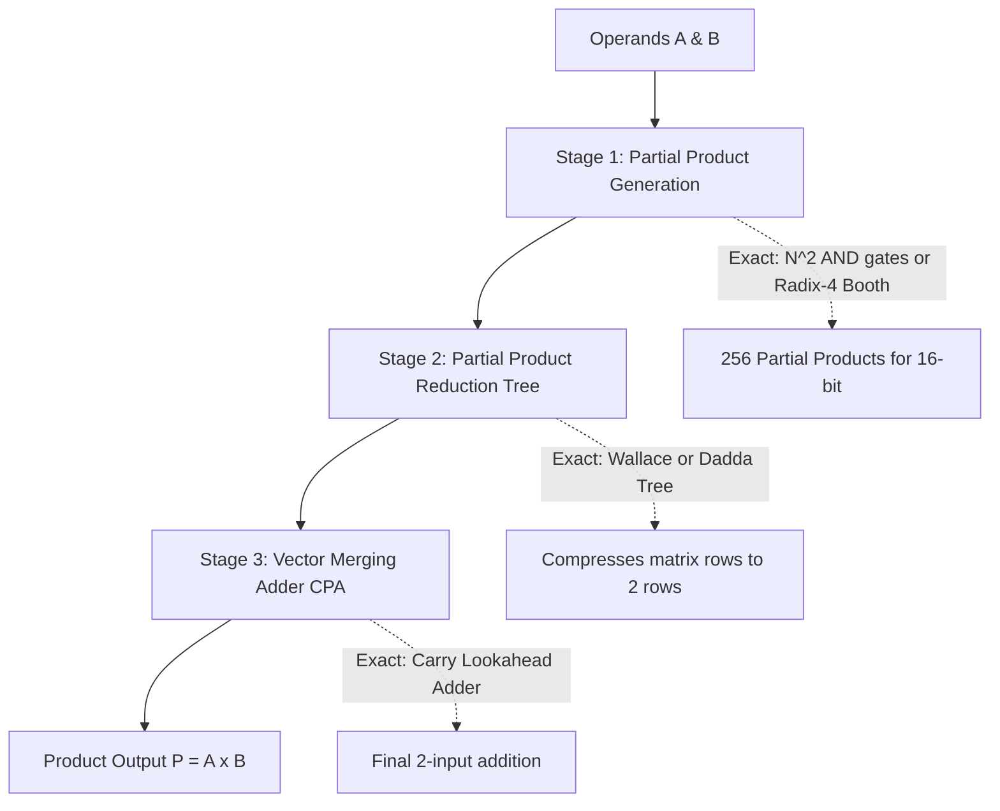

# Approximate Multipliers Taxonomy

Multipliers are the heaviest power and area consumers in digital processors. In modern digital signal processors (DSPs) and AI chips, **over 70% of arithmetic energy is spent inside multiplier arrays**.

This comprehensive guide breaks down how exact multipliers work, where the power bottlenecks live, and how approximate multiplier microarchitectures slash silicon energy by up to $75\%$.

---

## 🔬 Anatomy of a Hardware Multiplier

Multiplying two $N$-bit unsigned binary numbers ($A = \sum_{i=0}^{N-1} a_i 2^i$ and $B = \sum_{j=0}^{N-1} b_j 2^j$) in hardware consists of three distinct pipeline stages:



### Stage 1: Partial Product Generation (PPG)
- **Standard Array**: An $N \times N$ matrix of bits ($16 \times 16 = 256$ bits) is generated using simple `AND` gates ($p_{i,j} = a_i \cdot b_j$).
- **Radix-4 Modified Booth Encoding (MBE)**: Groups multiplier bits in triplets $(b_{2i+1}, b_{2i}, b_{2i-1})$ to encode multiples $\{0, \pm 1A, \pm 2A\}$, reducing the number of partial product rows from $N$ to $N/2$ (8 rows for 16-bit).

### Stage 2: Partial Product Reduction (PPR)
The tall partial product matrix is compressed down to just two rows using layers of **Full Adders (3:2 compressors)** and **4:2 Compressors**:
- **Wallace Tree**: Compresses as aggressively as possible at every stage to minimize total layer count ($\mathcal{O}(\log_{1.5} N)$).
- **Dadda Tree**: Postpones compression to minimize the total number of full adders required, saving silicon area.

### Stage 3: Vector Merging (Final CPA)
The final two compressed rows are added together using a fast **Carry-Propagate Adder (CPA)** (e.g. Kogge-Stone or Carry-Lookahead) to produce the final $2N$-bit product.

---

## 🎛️ Interactive Lab: Multiplier Playground

Try dragging the operand sliders below to compare how **Exact**, **Truncated**, **RoBA**, and **DRUM** multipliers calculate answers in real time:

<iframe
  src="../../labs/multiplier-explorer.html"
  title="Interactive Multiplier Explorer"
  style="width: 100%; height: 560px; border: none; background: transparent; margin: 12px 0;"
  loading="lazy"
></iframe>

---

## 🏛️ The Four Core Approximate Multiplier Architectures

```mermaid
graph TD
    M[Approximate Multipliers] --> F1[1. Inexact Reduction Compressors]
    M --> F2[2. Dynamic Windowing DRUM]
    M --> F3[3. Power-of-2 Rounding RoBA]
    M --> F4[4. Logarithmic Arithmetic]

    F1 --> D1[AC-4:2: 14T logic replacing 26T XOR trees]
    F2 --> D2[LOD extracts k-bit active slice; 60% area saved]
    F3 --> D3[A x B approx Ar*B + Br*A - Ar*Br using shifts only]
    F4 --> D4[Mitchell & REALM: log2(A) + log2(B)]
```

---

### 1. Inexact 4:2 Compressors (AC-4:2)
Instead of modifying input operands, **compressor-based approximate multipliers** replace the exact 26-transistor 4:2 compressor cells inside the Wallace tree with simplified Boolean logic:

$$\text{Exact 4:2 Compressor}: \quad \text{Sum} = x_1 \oplus x_2 \oplus x_3 \oplus x_4 \oplus C_{\text{in}}, \quad 26 \text{ Transistors}$$

$$\text{Approximate AC-4:2}: \quad \text{Sum}' = (x_1 \oplus x_2) \mid (x_3 \oplus x_4), \quad \text{Carry}' = (x_1 \cdot x_2) \mid (x_3 \cdot x_4), \quad 14 \text{ Transistors}$$

- **Transistor Savings**: **$46.2\%$ fewer transistors** per compressor cell.
- **Truth Table Accuracy**: Correctly matches $28$ out of $32$ input states ($87.5\%$ accuracy), with deviations never exceeding $1$ count.

---

## 🗜️ Interactive Lab: 4:2 Compressor Playground

Click the 4 input bits below to see how an approximate 4:2 compressor replaces complex XOR gates with fast logic while maintaining $87.5\%$ exact truth-table matches:

<iframe
  src="../../labs/compressor-4to2-playground.html"
  title="4:2 Approximate Compressor Playground"
  style="width: 100%; height: 500px; border: none; background: transparent; margin: 12px 0;"
  loading="lazy"
></iframe>

---

### 2. Dynamic Range Unbiased Multiplier (DRUM)
- **The Concept**: Most numbers in real datasets (audio, image pixels, weights) do not use all 16 bits simultaneously.
- **Microarchitecture**:
  1. A **Leading-One Detector (LOD)** scans both inputs $A$ and $B$ to find their highest active bit positions $k_1, k_2$.
  2. A barrel shifter extracts a small $k$-bit window (e.g. $k=4$).
  3. A small $4 \times 4$ hardware multiplier multiplies the two slices.
  4. A final barrel shifter scales the result back by $2^{k_1 + k_2}$.
- **Result**: Replaces a large $16 \times 16$ multiplier ($256$ product gates) with a tiny $4 \times 4$ core ($16$ product gates), saving **$60\%$ silicon area** with $<1.8\%$ relative error.

---

### 3. Rounding-Based Multiplier (RoBA)
- **The Concept**: In binary arithmetic, multiplying by a power of two ($2^k$) is a wire shift with **zero logic gates**.
- **The Formula**: RoBA rounds both inputs $A$ and $B$ to their nearest powers of two ($A_r = 2^{k_1}, B_r = 2^{k_2}$) and calculates:
  $$A \times B \approx A_r \cdot B + B_r \cdot A - A_r \cdot B_r$$
- **Hardware Realization**: The multiplier consists of two barrel shifters and a single subtractor. The entire multi-row multiplier array is eliminated, saving **$75\%$ power**.

---

### 4. Truncation & Rounding-Based Scalable Multipliers (TOSAM)
- Divides inputs into truncated least-significant bits and rounded most-significant bits.
- Allows hardware designers to dynamically tune accuracy levels from 100% exact down to ultra-low energy mode.

---

## 📚 Primary Literature & IEEE Citations

For researchers and students exploring original peer-reviewed proofs and silicon measurements:

- **Dynamic Range Multipliers (DRUM)**:  
  S. Hashemi et al., *"DRUM: A Dynamic Range Unbiased Multiplier for Approximate Applications"*, IEEE/ACM ICCAD, [IEEE Xplore (DOI: 10.1109/ICCAD.2015.7372600)](https://doi.org/10.1109/ICCAD.2015.7372600).
- **Rounding-Based Multipliers (RoBA)**:  
  R. Zendegani et al., *"RoBA Multiplier: A High-Performance Approximate Multiplier for Energy-Efficient DSP Applications"*, IEEE TVLSI, [IEEE Xplore (DOI: 10.1109/TVLSI.2016.2603348)](https://doi.org/10.1109/TVLSI.2016.2603348).
- **Compressor-Based Approximate Multipliers (AC-4:2)**:  
  P. Kulkarni et al., *"A Design Approach for Compressor-Based Approximate Multipliers"*, IEEE VLSI Design, [IEEE Xplore (DOI: 10.1109/vlsid.2015.41)](https://doi.org/10.1109/vlsid.2015.41).
- **Truncation and Rounding Multipliers (TOSAM)**:  
  H. Saadat et al., *"TOSAM: An Energy-Efficient Truncation- and Rounding-Based Scalable Approximate Multiplier"*, IEEE TVLSI, [IEEE Xplore (DOI: 10.1109/TVLSI.2019.2941219)](https://doi.org/10.1109/TVLSI.2019.2941219).
- **Logarithmic Multipliers (Dynamic Range ALM / Mitchell)**:  
  V. M. et al., *"Design of Dynamic Range Approximate Logarithmic Multipliers"*, IEEE TCSI, [IEEE Xplore (DOI: 10.1109/TCSI.2022.3167894)](https://doi.org/10.1109/TCSI.2022.3167894).
