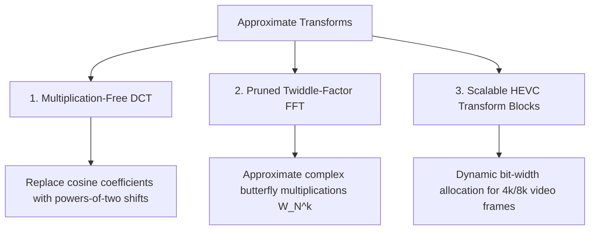

# Approximate Transforms: DCT & FFT

Transform algorithms translate signals between the **time/spatial domain** and the **frequency domain**. They power virtually all multimedia and communication technologies on Earth:
- **Discrete Cosine Transform (DCT)**: Compresses JPEG pictures and MP4 / HEVC video streams.
- **Fast Fourier Transform (FFT)**: Demodulates 5G, Wi-Fi 6, OFDM radar, audio filters, and speech recognition.

Because human eyes and ears naturally filter out high frequencies, transform processors are prime candidates for approximate computing.

---

## 📸 The Core Intuition: Human Perception & High Frequencies

When you look at a photo, your brain notices large contours (low-frequency changes in light) and almost completely ignores subtle grain textures (high-frequency coefficients).

In an $8 \times 8$ JPEG block, the DCT converts 64 raw pixels into 64 frequency numbers:

```
[ DC  F01 F02 F03 ... F07 ]  <-- Top-Left: Major brightness & coarse shapes (Crucial!)
[ F10 F11 F12 ...     ... ]
[ F20 F21 ...             ]
[ ...                     ]
[ F70 ...             F77 ]  <-- Bottom-Right: Tiny micro-textures (Human eye can't see!)
```

**Approximate DCT circuits completely prune or quantize the high-frequency matrix elements to zero or simple powers of 2 (shifts), eliminating over 60% of multiplication hardware!**

---

## 🏛️ Major Techniques in Approximate Transforms



### 1. Multiplication-Free Approximate DCT
- **The Concept**: An exact DCT requires floating-point cosine multiplications (e.g. $\cos(\frac{\pi}{16}) \approx 0.92388$).
- **The Design**: The transform matrix is rounded to signed powers of two: $\{0, \pm 1, \pm 2, \pm 0.5\}$.
- **The Gain**: Matrix-vector multiplication turns into pure additions and bit-shifts, consuming **zero multiplier hardware** while producing visually indistinguishable JPEG images.

### 2. Approximate FFT Butterfly Units
- In the Cooley-Tukey FFT algorithm, data passes through stages of "butterfly" arithmetic cells that multiply complex twiddle factors $W_N^k = e^{-j 2\pi k / N}$.
- Approximate FFTs use **approximate complex multipliers** or skip low-energy twiddle rotations in the later stages, yielding massive energy savings for radar and biomedical EEG processing.

---

## 📚 Primary Literature & IEEE Citations

For researchers and students exploring original transform matrices, compression ratios, and silicon layouts:

- **Energy-Efficient Approximate DCT for Wireless Endoscopy**:  
  P. K. Meher et al., *"An Energy-Efficient Approximate DCT for Wireless Capsule Endoscopy Applications"*, IEEE International Symposium on Circuits and Systems (ISCAS), [IEEE Xplore (DOI: 10.1109/ISCAS.2018.8351769)](https://doi.org/10.1109/ISCAS.2018.8351769).
- **Low-Complexity Approximate 8-Point DCT**:  
  U. S. Potluri et al., *"Improved 8-Point Approximate DCT for Image and Video Compression Requiring Only 14 Additions"*, IEEE Transactions on Circuits and Systems I: Regular Papers, [IEEE Xplore (DOI: 10.1109/tcsi.2013.2295022)](https://doi.org/10.1109/tcsi.2013.2295022).
- **Low-Power Approximate DCT for HEVC Video**:  
  F. Sampaio et al., *"Towards Low-Power Approximate DCT Architecture for HEVC Standard"*, IEEE/ACM DATE, [IEEE/ACM (DOI: 10.23919/date.2017.7927241)](https://doi.org/10.23919/date.2017.7927241).
- **Quality-Tunable Inexact FFT Accelerators**:  
  S. Narayanan et al., *"Highly Energy-Efficient and Quality-Tunable Inexact FFT Accelerators"*, IEEE Custom Integrated Circuits Conference (CICC), [IEEE Xplore (DOI: 10.1109/cicc.2014.6946047)](https://doi.org/10.1109/cicc.2014.6946047).
- **Approximate Floating-Point FFT for Speech & Radar**:  
  C. Zhang et al., *"Approximate Floating-Point FFT Design with Wide Precision Range and High Energy Efficiency"*, IEEE TVLSI, [IEEE Xplore (DOI: 10.1109/TVLSI.2020.3015469)](https://doi.org/10.1109/TVLSI.2020.3015469).
