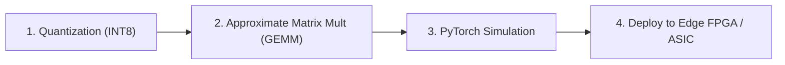

# Track 2: AI & Edge Hardware Accelerator

This roadmap guides you through building ultra-efficient AI accelerators using approximate multipliers for neural networks like ResNet, YOLO, and Vision Transformers.

---

## 🎯 Milestones

### Milestone 1: Quantization & Error Sensitivity
- Understand how floating-point weights (FP32) are converted to 8-bit integers (INT8).
- Identify which neural network layers (e.g. early convolutional layers vs final classifier) are most sensitive to approximation.

### Milestone 2: Emulating Inexact Multiplications in Python
- Implement custom PyTorch `torch.autograd.Function` operators that plug in DRUM or RoBA multiplier models during inference.

### Milestone 3: Benchmark Accuracy on ImageNet / CIFAR-10
- Run full inference passes on standard image datasets.
- Measure Top-1 classification accuracy drop and ensure $\Delta \text{Acc} \le 0.5\%$.
