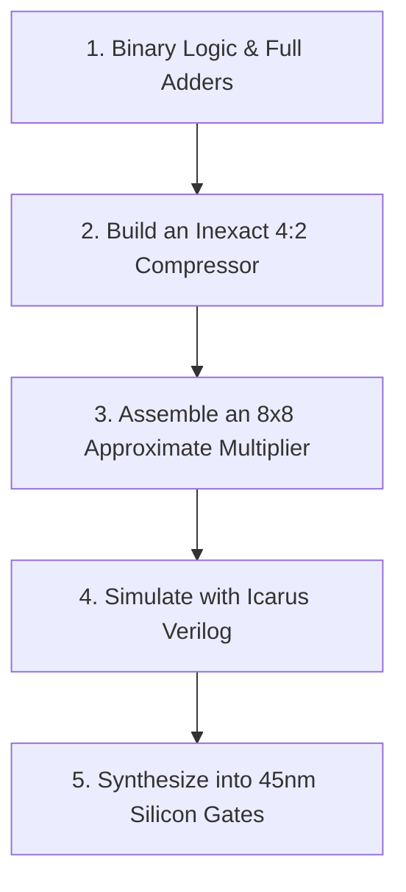

# Track 1: The Circuit Hacker (Verilog & Hardware)

Welcome to the **Circuit Hacker Track**! This roadmap is designed for students and aspiring silicon engineers who want to design synthesizable digital circuits in Verilog.

---

## 🛠️ Step-by-Step Learning Path

### Stage 1: The Basic Gates & Truth Tables
- Understand `AND`, `OR`, `XOR` logic gates.
- Build an exact Full Adder:
  $$\text{Sum} = A \oplus B \oplus C_{in}, \quad C_{out} = (A \cdot B) + (C_{in} \cdot (A \oplus B))$$

### Stage 2: The Inexact Hack
- Look at the 4:2 compressor truth table.
- Identify output combinations that cost 5 extra transistors.
- Modify the Boolean equation to simplify the gate count while keeping error rate under $5\%$.

### Stage 3: Verilog RTL Implementation
- Write clean, synthesizable Verilog for your approximate multiplier.
- Write a self-checking testbench (`tb_top.v`) that tests all 65,536 input combinations and calculates total error distance.

### Stage 4: Synthesis & ASIC Area
- Synthesize your Verilog code using open PDKs (FreePDK45 / ASAP7).
- Compare your silicon area and power consumption against the exact multiplier!
